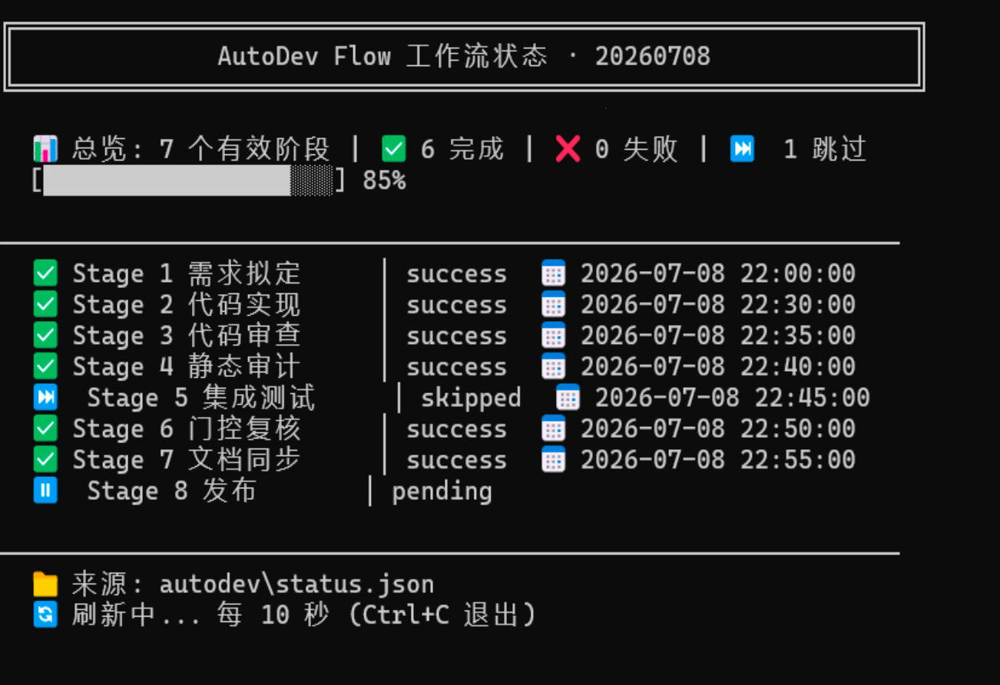

# AutoDev Flow

> **通用的自动化开发工作流**——把 SDLC 拆成 7 个阶段，纯 Markdown 指令交付，可被 Codex、Claude Code、Cursor 等任意 AI Agent 加载执行，自带闭环迭代与门控审计。

## 核心优势

- **通用兼容** — 纯 Markdown 指令，Codex / Claude / Cursor 执行逻辑完全一致，团队各用各的 Agent 也能流程统一。
- **7 阶段全链路** — 需求 → 开发 → 审查 → 审计 → 测试 → 门控 → 文档，前序产出即后序输入，缺一不可。
- **闭环自动迭代** — Stage 6 把异常项自动回种为任务卡（`autopush-*`），下一轮 Stage 2 接手处理；不修复不放行。
- **三层质量把关** — 静态审查（规范/性能/安全 17+ 检查项）→ 静态审计（四态判定）→ 运行验证（4 类验证），门控复核统一收口。
- **完整审计链** — 任务卡 + 审计报告 + status.json 三类产物，Stage 7 渲染状态表到追踪文档，一份文档看完全部 Stage。
- **职责分离** — 开发不审查、审查不修复、审计不写代码，角色边界清晰，产出可独立审计。
- **防覆盖保护** — 任务文件只追加不覆盖、续号前先读、幂等写入、元信息照抄。
- **工程化** — 参数化配置适配多项目、单阶段触发、任务去重、跨天挂起提醒、服务自动启动、CI/CD 友好。

## 性能优势

| 指标 | 预估 | 说明 |
|------|------|------|
| 对话轮次 | **降低 ~40%** | 结构化阶段输入/输出，减少需求澄清和上下文重复加载的来回 |
| Token 消耗 | **减少 ~30%** | Reference 文件按需加载，每阶段只读取相关指令，避免全量 prompt |
| 首次通过率 | **≥ 80%** | 任务卡含验证清单 + 代码审查自动拦截，需求理解偏差在 Stage 4 前暴露 |
| 端到端周期 | **缩短 ~50%** | 审查/测试/文档同步自动串联，无需人工等待和手动衔接 |
| 遗留缺陷 | **≤ 10%** | 门控复核 + 跨天挂起提醒，未修复项不会静默流失 |

## 快速开始

**安装**：

```bash
# Codex
npx @openai/codex skill install --repo YuanYii/autodev-flow
# Claude Code
cp -r autodev-flow ~/.claude/skills/autodev-flow
```

**直接拷贝到项目路径**（不依赖 Agent 的 skills 目录，任何 Agent 通用）：

```bash
# 1. 将 autodev-flow 目录拷贝到项目下的 autodev/skills/
mkdir -p autodev/skills
cp -r autodev-flow autodev/skills/autodev-flow

# 2. 编辑项目配置
vim autodev/skills/autodev-flow/template/config.template.json

# 3. 在对话中告诉 Agent 工作流指令的位置即可触发
#    "读取 autodev/skills/autodev-flow/SKILL.md，执行完整工作流"
```

> 这种方式把工作流指令随项目一起版本管理，团队成员 clone 仓库后即可使用，无需各自安装。

## 使用说明

### 典型工作流程

```
Stage 1 需求拟定 → Stage 2 开发 → Stage 3 审查 → Stage 4 审计 → Stage 5 测试 → Stage 6 门控 → Stage 7 文档
```

### 阶段触发方式

**单阶段执行**：

```bash
# 需求分析（将用户需求拆解为结构化任务卡）
"使用 autodev-flow，执行 Stage 1，帮我开发一个贪吃蛇游戏，要求使用html+js"

# 需求分析（多条需求）
"使用 autodev-flow，执行 Stage 1，需求1:新增用户注册;需求2:优化登录流程"

# 更新已有需求
"使用 autodev-flow，执行 Stage 1，更新需求 20260601-DEV-001：增加手机号注册支持"
```

**批量执行**：

```bash
# 从开发到文档同步（需求已确定时）
"使用 autodev-flow，执行 Stage 2-7"

# 完整工作流（从需求到文档）
"使用 autodev-flow 执行完整工作流"
```

**指定任务执行**：

```bash
# 处理特定任务
"使用 autodev-flow，处理 20260707-DEV-001"
```

### 各阶段说明

| Stage | 触发场景 | 输入 | 输出 |
|-------|---------|------|------|
| 1 | 新增需求或更新需求 | 用户需求描述 | 结构化任务卡（BUG/OPT/DEV） |
| 2 | 任务卡已就绪 | 任务文档 | 代码改动 + 处理报告 |
| 3 | 代码已提交 | 任务文档 + 代码文件 | 审查报告（🔴/🟡/🟢） |
| 4 | 审查报告已生成 | 任务文档 + 审查报告 | 验收报告（✅/⚠️/❌/🔍） |
| 5 | 验收报告有 🔍 项 | 验收报告 | 集成测试报告（✅/❌） |
| 6 | 所有报告已就绪 | 审查/验收/测试报告 | 修复卡 + 门控文件 |
| 7 | 门控通过（BUG=0, DEV=0） | 任务文档 + 所有报告 | 文档更新 + 状态表 |

**任务卡示例**：

```
### 20260624-BUG-001 | 高 | ✅ 已完成

- **描述**：
  执行完数据备份+数据恢复后，管理员退出登录再登录时：
  1. **数据恢复记录丢失**：restore_record 表为空（0 条），恢复操作的历史记录完全消失
  2. **备份状态显示"执行中"**：backup_record 的最新记录显示 RUNNING 而非实际的 SUCCESS/FAILED

- **根因分析**：
  - 恢复操作调用 `sqlite-import.sh` 会删除原 DB 并从备份重建
  - 备份是在 restore_record 创建之前做的，所以恢复后的 DB 不含 restore_record

- **修复建议**：
  1. 修改 `RestoreStartupReconciler.reconcile()`，在新 DB 中补建 restore_record
  2. 恢复完成后检查 backup_record 状态，修正为实际终态

- **涉及文件列表**：...
```

### 查看状态

```bash
# macOS / Linux
bash autodev/status.sh                    # 阶段状态面板（需 jq）
bash autodev/status.sh --tasks            # 展示任务状态
bash autodev/status.sh --watch            # 动态刷新（默认 10 秒）
bash autodev/status.sh --watch --tasks    # 刷新 + 任务状态

# Windows PowerShell
powershell -ExecutionPolicy Bypass -File autodev\status.ps1
powershell -ExecutionPolicy Bypass -File autodev\status.ps1 -Tasks
powershell -ExecutionPolicy Bypass -File autodev\status.ps1 -Watch
powershell -ExecutionPolicy Bypass -File autodev\status.ps1 -Watch -Tasks
powershell -ExecutionPolicy Bypass -File autodev\status.ps1 -Watch -Interval 5
```

**执行状态监控示例**：



### 常见问题

**Q: Stage 7 为什么没有执行？**
A: Stage 7 有门控检查，只有当 Stage 6 的 BUG=0 且 DEV=0 时才会执行。请检查 Stage 6 的门控文件。

**Q: 任务卡编号规则是什么？**
A: 格式为 `{RUN}-{TYPE}-{NNN}`，如 `20260707-DEV-001`。RUN 是日期，TYPE 是 BUG/OPT/DEV，NNN 是序号。

**Q: autopush 卡片是什么？**
A: Stage 6 门控复核时，会将审计发现的异常项自动回种为任务卡，编号前缀为 `autopush-`，下一轮 Stage 2 会接手处理。

**Q: 如何回滚代码？**
A: Stage 2 开发实现时，如果编译失败会立即回滚。任务状态标记为 🔴 未完成，并记录失败原因。

## 配置说明

编辑 `template/config.template.json`，将 `{{占位符}}` 替换为实际值：

| 分组 | 字段 | 说明 | 示例 |
|------|------|------|------|
| project | name | 项目名 | `my-blog` |
| project | nameEn | 英文项目名 | `my-blog` |
| project | workspace | 项目根目录 | `/Users/dev/my-blog` |
| modules | backend | 后端目录名 | `backend` |
| modules | frontend | 前端目录名 | `frontend` |
| modules | app | 应用模块名 | `app` |
| database | type | 数据库类型 | `SQLite` / `MySQL` / `PostgreSQL` |
| database | devFile | 开发数据库文件 | `dev.db` |
| database | schemaSqlite | SQLite schema 路径 | `docs/schema-sqlite.sql` |
| database | schemaMysql | MySQL schema 路径 | `docs/schema-mysql.sql` |
| techStack | backend | 后端框架 | `Spring Boot` / `Express` / `Django` |
| techStack | orm | ORM 框架 | `MyBatis-Plus` / `Prisma` |
| techStack | frontend | 前端框架 | `Nuxt 3` / `Next.js` / `Vue` |
| techStack | language | 编程语言 | `["Java", "TypeScript"]` |
| techStack | cache | 缓存技术 | `Redis` |
| ports | backend | 后端端口 | `8080` |
| ports | frontend | 前端端口 | `3000` |
| ports | redis | Redis 端口 | `6379` |
| api | prefix | API 前缀 | `/api/v1` |
| api | healthCheck | 健康检查端点 | `/health` |
| docs | design | 设计文档路径 | `docs/design/设计文档.md` |
| docs | readme | README 路径 | `README.md` |
| docs | agents | AGENTS.md 路径 | `AGENTS.md` |
| docker | redisImage | Redis 镜像 | `redis:7-alpine` |
| docker | containerName | Redis 容器名 | `my-blog-redis` |

## 工作流概览

```
Stage 1 需求拟定 → 任务卡（BUG/OPT/DEV，含验证清单）
   ↓
Stage 2 开发实现 → 代码改动 + 处理报告（编译验证）
   ↓
Stage 3 代码审查 → 审查报告（🔴 严重问题回种 BUG 区段）
   ↓
Stage 4 测试审计 → 验收报告（✅/⚠️/❌/🔍 四态判定）
   ↓
Stage 5 集成测试 → 测试报告（🔍 项转为 ✅/❌ 确定结论）
   ↓
Stage 6 门控复核 → 修复卡（异常项回种）+ 门控文件
   ↓
Stage 7 文档同步 → README + 设计文档增量更新 + 工作流状态表
```

| Stage | 角色 | 核心动作 | 指令文件 |
|-------|------|----------|----------|
| 1 | 需求拟定 | 拆解+去重+编号，生成结构化任务卡 | `LLM-01-requirement-drafter.md` |
| 2 | 开发实现 | BUG→OPT→DEV 顺序处理，编译必过 | `LLM-02-developer.md` |
| 3 | 代码审查 | 规范/性能/安全三维度，🔴 回种 | `LLM-03-code-reviewer.md` |
| 4 | 测试审计 | 静态核对验证清单，四态判定 | `LLM-04-test-engineer.md` |
| 5 | 集成测试 | 实际运行验证 🔍 项，服务自动启动 | `LLM-05-integration-tester.md` |
| 6 | 门控复核 | 异常项分类映射为 autopush 卡片 | `LLM-06-project-manager.md` |
| 7 | 文档同步 | 门控检查 + 增量同步 + 状态渲染 | `LLM-07-doc-engineer.md` |

## 工作流产出说明

每个 Stage 执行后都会产出明确的文件，形成完整审计链：

| Stage | 产出文件 | 作用 |
|-------|----------|------|
| 1 | `autodev/auto_iteration/{RUN}.md`（追加任务卡） | 结构化任务卡：编号、描述、验证清单、涉及文件 |
| 2 | 代码改动 + 处理报告（追加到任务文档） | 实际代码修改 + 每个任务的处理结果与验证结论 |
| 3 | `autodev/auto_audit/{RUN}/{RUN}-stage3.md` | 代码审查报告：🔴严重/🟡警告/🟢建议，含 文件:行号 |
| 4 | `autodev/auto_audit/{RUN}/{RUN}-stage4.md` | 需求验收报告：每条验证清单的 ✅/⚠️/❌/🔍 判定 |
| 5 | `autodev/auto_audit/{RUN}/{RUN}-stage5.md` | 集成测试报告：🔍 项的实际运行结论（✅/❌）+ 证据 |
| 6 | `autodev/auto_audit/{RUN}/{RUN}-stage6.md` + autopush 卡片 | 门控文件（异常计数）+ 异常项回种到任务文档 |
| 7 | README + 设计文档（增量更新）+ 状态表 | 文档同步 + `status.json` 渲染到任务文档末尾 |

三类核心产物：

| 产物 | 路径 | 说明 |
|------|------|------|
| **任务追踪文档** | `autodev/auto_iteration/{RUN}.md` | 当天全貌：任务卡 + 处理报告 + 工作流状态表，一份文档看完所有 Stage 结论 |
| **审计报告** | `autodev/auto_audit/{RUN}/{RUN}-stage{3-6}.md` | Stage 3/4/5/6 各自独立报告，互不覆盖，可单独回溯 |
| **状态文件** | `autodev/status.json` | 7 个 Stage 实时状态（success/failed/skipped），流水线唯一真相源 |

> **设计要点**：所有产出均为 Markdown / JSON 纯文本，可被 Git 版本管理、可被 CI 管道读取、可被人工直接阅读。任务文件只追加不覆盖，历史记录完整保留。

## 数据流

```
autodev/
├── config.json              # 项目配置
├── status.json              # 工作流状态（唯一真相源）
├── status.sh                # 状态查看脚本（macOS/Linux）
├── status.ps1               # 状态查看脚本（Windows）
├── auto_iteration/{YYYYMMDD}.md   # 任务卡 + 处理报告 + 状态表
├── auto_audit/{YYYYMMDD}/
│   ├── {YYYYMMDD}-stage3.md  # 代码审查
│   ├── {YYYYMMDD}-stage4.md  # 测试审计
│   ├── {YYYYMMDD}-stage5.md  # 集成测试
│   └── {YYYYMMDD}-stage6.md  # 门控文件
└── skills/autodev-flow/     # 本工作流指令（SKILL.md + references/ + scripts/）
```

## 关键规则

| 规则 | 说明 |
|------|------|
| 防覆盖 | 任务文件只能 Edit 追加，严禁 Write 覆盖 |
| 任务编号 | `{RUN}-{TYPE}-{NNN}`；回种卡 `autopush-{RUN}-{TYPE}-{NNN}` |
| 单次上限 | 最多 5 个任务；跨天挂起任务单列提醒 |
| 门控检查 | Stage 7 仅在 Stage 6 的 BUG=0 且 DEV=0 时执行 |
| 状态真相源 | `status.json` 是流水线状态唯一来源 |
| 时区 | 所有时间字段用北京时区 UTC+8 |

## 兼容 Agent

| Agent | 目录 |
|-------|------|
| Codex | `.codex/skills/autodev-flow/` |
| Claude Code | `.claude/skills/autodev-flow/` |
| 通用 | 任意 Agent 可访问路径 |

## License

MIT
